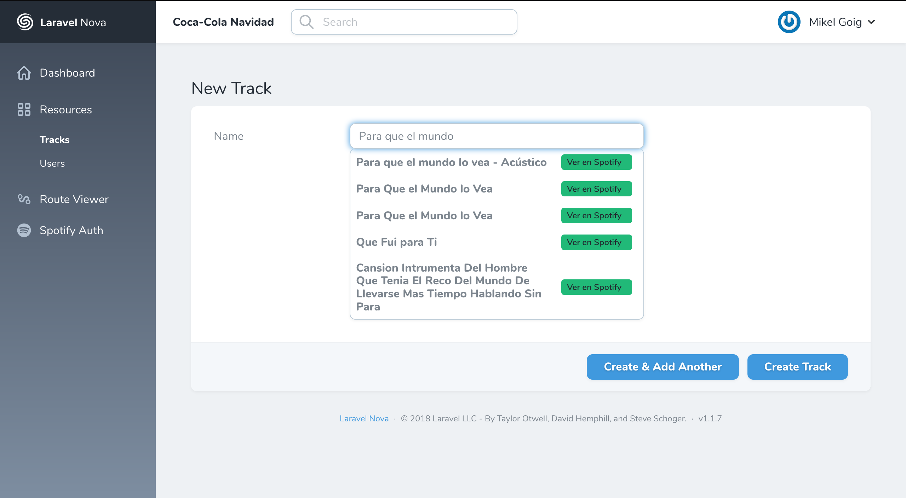

# Laravel Nova Spotify Track Field

[](https://packagist.org/packages/mgoigfer/nova-spotify-track-field)
[](https://travis-ci.org/mgoigfer/nova-spotify-track-field)
[](https://scrutinizer-ci.com/g/mgoigfer/nova-spotify-track-field)
[](https://packagist.org/packages/mgoigfer/nova-spotify-track-field)

This [Nova](https://nova.laravel.com/) package adds a Spotify track field. Under the hood it uses the [mgoigfer/laravel-spotify-wrapper](https://github.com/mgoigfer/laravel-spotify-wrapper) and [mgoigfer/nova-spotify-auth-tool](https://github.com/mgoigfer/nova-spotify-auth-tool) packages.

You can add tracks from the [Spotify Web API](https://developer.spotify.com/documentation/web-api/) to your database.



## Installation

First, you must install [mgoigfer/laravel-spotify-wrapper](https://github.com/mgoigfer/laravel-spotify-wrapper) and [mgoigfer/nova-spotify-auth-tool](https://github.com/mgoigfer/nova-spotify-auth-tool) into your Laravel app.

Next, you can install this package via [Composer](https://getcomposer.org/):

```bash
composer require mgoigfer/nova-spotify-track-field
```

## Use

Register the field in your resource's `fields` method:

```php
/**
 * Get the fields displayed by the resource.
 *
 * @param  \Illuminate\Http\Request  $request
 * @return array
 */
public function fields(Request $request)
{
    return [
        ...
        \Mgoigfer\SpotifyTrackField\SpotifyTrackField::make('Name')
            ->spotifyAccessToken()
            ->extraAttributes([
                'id' => 'spotify_id',
                'artist_name' => 'artist',
                'duration_ms' => 'duration_ms',
                'popularity' => 'popularity',
                'preview_url' => 'preview_url',',
            ]),
        ...
    ];
}
```

You must use the following methods:

* `spotifyAccessToken`: to request a Spotify `access token` from the `refresh token` stored in the database (see [mgoigfer/nova-spotify-auth-tool](https://github.com/mgoigfer/nova-spotify-auth-tool)).
* `extraAttributes`: a key-value array that indicates which track attributes you would like to store (keys), and the column name in your database where they may be stored (values).

### List of track attributes:

* `id`: The Spotify ID for the track.
* `name`: The name of the track.
* `artist_id`: The Spotify ID for the artist.
* `artist_name`: The name of the artist
* `duration_ms`: The track length in milliseconds.
* `popularity`: The popularity of the track. The value will be between 0 and 100, with 100 being the most popular.
* `preview_url`: A link to a 30 second preview (MP3 format) of the track. Can be `null`.
* `first_letter`: The first letter of the track (e.g. in `Tail Lights` will be `T`).

More info in the [Spotify Web API](https://developer.spotify.com/documentation/web-api/reference/tracks/get-track/).

## Changelog

Please see [CHANGELOG](CHANGELOG.md) for more information on what has changed recently.

## Contributing

Please see [CONTRIBUTING](CONTRIBUTING.md) for details.

## Credits

- [Mikel Goig](https://github.com/mgoigfer)

## License

The MIT License (MIT). Please see [License File](LICENSE.md) for more information.
